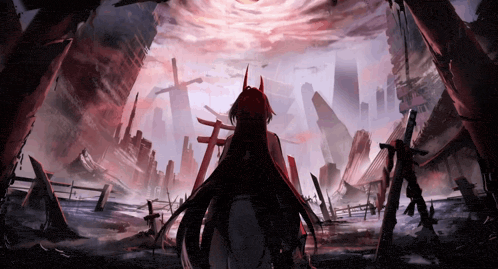
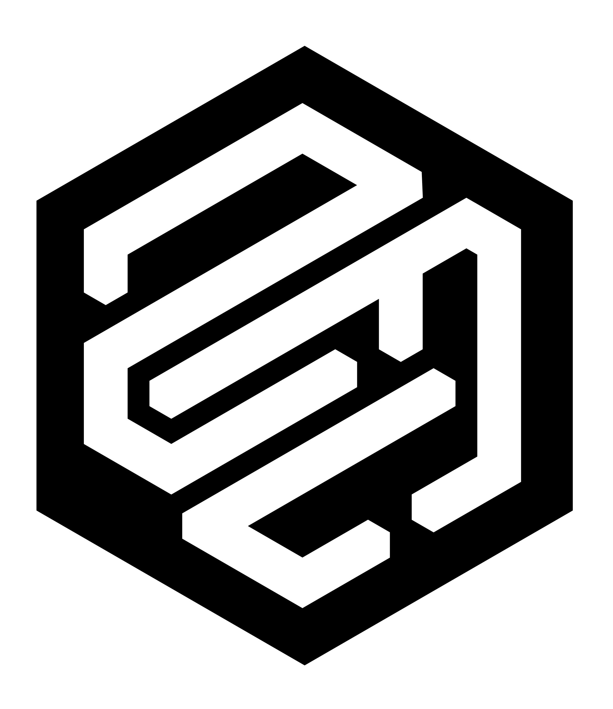

 

# DZAKY FADLI

### `FULLSTACK DEVELOPER` · `BACKEND-ORIENTED` · `AI/ML ENTHUSIAST`

Building web applications, APIs, and data-driven solutions with a focus on practical and maintainable software.

 

---

## About Me

I'm a **Fullstack Developer with a backend focus**, interested in building web applications, REST APIs, and data-driven systems.

My main experience is around **Laravel, Go, React, Python, and PostgreSQL**, with additional interest in **AI/ML and integrating machine learning into practical applications**.

I enjoy working on projects where I can understand the problem, design the system, build the implementation, and improve it through testing and iteration.

Currently, I'm **open to opportunities in software development**, particularly backend and fullstack roles.

## Tech Stack

## Research

### Match Outcome Prediction in Draft Pick and In-game Phases of MSC 2025 Mobile Legends using Random Forest and XGBoost

Published in the **Journal of Applied Informatics and Computing, Vol. 9 No. 6, 2025**.

The research explores machine learning approaches for predicting esports match outcomes using data from **MSC 2025 Mobile Legends**, comparing Random Forest and XGBoost across draft pick and in-game phases.

## Beyond Coding

Outside of software development, I spend my time playing games, exploring technology, and occasionally turning random ideas into small projects.

You can also check my **Honkai: Star Rail** account here:

---

 

### KEEP BUILDING. KEEP LEARNING.

Software, research, games, and whatever seems interesting enough to build.

